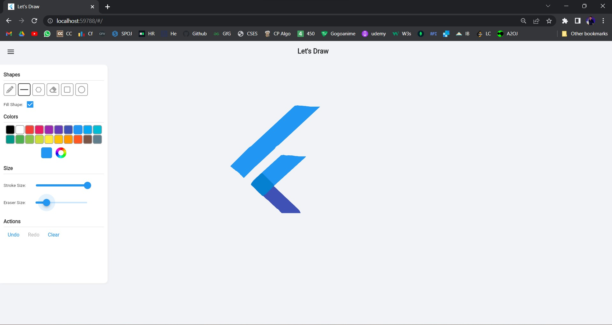
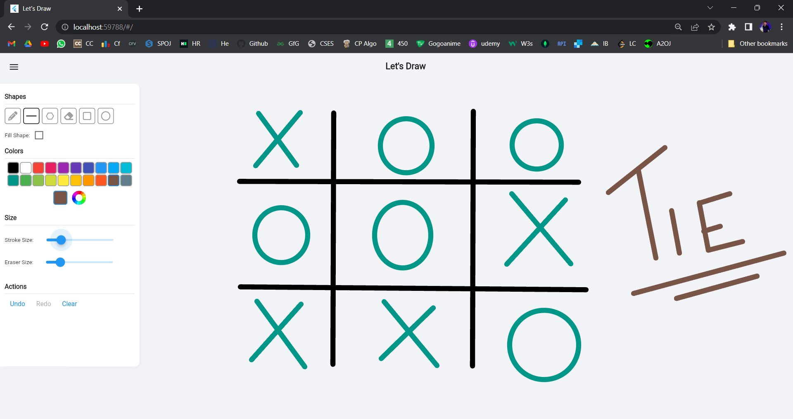

# 🎨🎨Let's Draw
A simple drawing app made with Flutter

## 💻 Requirements

- Any Operating System (ie. MacOS X, Linux, Windows)
- Any IDE with Flutter SDK installed (ie. Android Studio, VSCode, IntelliJ, etc)
- A little knowledge of Dart and Flutter

## ✨ Features

- [x] Scribble.
- [x] Draw Shapes (Line, Polygon, Ellipse and Rectangle).
- [x] Eraser.
- [x] Undo and Redo

## 📸 ScreenShots

## 🤓 Author(s)
- Paritosh Dev
- Preyal Ameta
- Aditya Priyam
- Utkarsh Choudhary
- Shubham Singh

